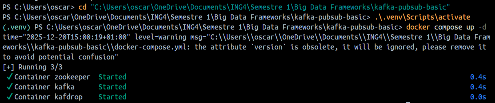
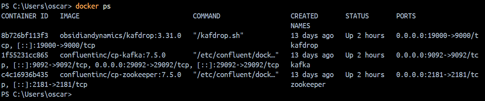
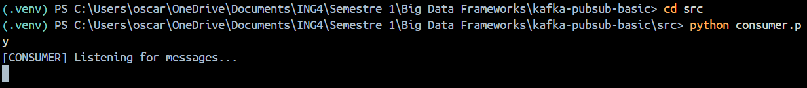
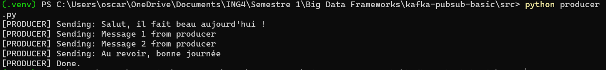
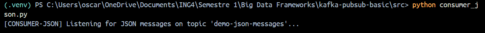
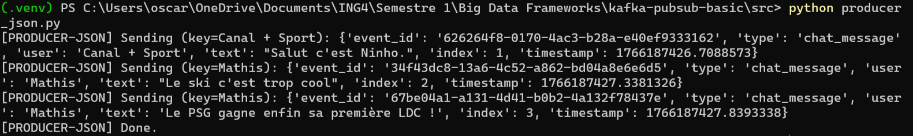
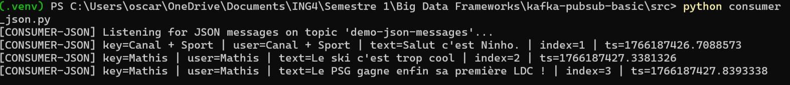

# Kafka Pub/Sub Basic System (Producer–Consumer)
#### By Oscar SCHWARTZ and Mathis LEITAO - ING4 DATA&IA Gr01

## Project Overview

This project demonstrates a **basic Publish/Subscribe messaging system** using **Apache Kafka**.  
It showcases how producers can publish messages to a Kafka topic and how consumers can subscribe to and process these messages asynchronously.

The project is implemented using:
- **Kafka** (Docker-based)
- **Python producers and consumers**
- **JSON message format**
- **Kafdrop** for monitoring and visualization

This project was developed as part of the **Big Data Frameworks** course to illustrate core messaging concepts in Big Data architectures.

---

## Why Kafka?

Apache Kafka is a distributed event streaming platform designed for:
- High-throughput data ingestion
- Decoupled producer/consumer architectures
- Real-time data pipelines
- Scalability and fault tolerance

Kafka is a core building block in modern Big Data ecosystems and is widely used for log ingestion, streaming analytics, microservices communication, and IoT pipelines.

---

## Technologies Used

- Apache Kafka (Docker)
- Docker Compose
- Python 3.12
- kafka-python library
- Kafdrop (Kafka Web UI)

---

## Project Architecture

Producer → Kafka Broker → Consumer  
                     ↘  
                      Kafdrop (Monitoring UI)

Kafka acts as a buffer and decoupling layer between producers and consumers.

---

## Prerequisites

- Docker Desktop
- Python 3.10+
- Git

---

## Setup Instructions

### 1. Clone the repository

```bash
git clone <your-repository-url>
cd kafka-pubsub-basic
```

## 2. Python environment setup (recommended)

To run the Kafka producer and consumer scripts, it is recommended to use a **Python virtual environment** to isolate dependencies.

### Create the virtual environment

From the root of the project:

```powershell
python -m venv .venv
```

### Activate the virtual environment (Windows)
```powershell
.\.venv\Scripts\activate
```

## Install dependencies
Upgrade pip and install the required packages:

```powershell
pip install --upgrade pip
pip install -r requirements.txt
```

## 3. Start Kafka and Kafdrop
Kafka and Kafdrop are started using Docker Compose.

### Start the services
```bash
docker compose up -d
```

Docker containers running:



Services exposed:

Kafka broker

Internal (Docker network): kafka:9092

Host access: localhost:29092

Kafdrop UI: http://localhost:19000

### Stop the services
```bash
docker compose down
```

## 4. Demo 1 — Basic Producer / Consumer (Text Messages)
This demo shows a simple text-based messaging flow using Kafka.

### Start the consumer

```powershell
cd src
python consumer.py
```


### Start the producer (in another terminal)
```powershell
cd src
python producer.py
```


Expected behavior:
The producer sends text messages to Kafka
The consumer receives and displays them
The topic appears in Kafdrop

## 5. Demo 2 — JSON-based Producer / Consumer

This demo demonstrates **structured event messaging** using JSON, which is a common best practice in real-world Kafka pipelines.  
Instead of sending plain text, the producer sends JSON objects (events), and the consumer deserializes them back into Python dictionaries.

### 5.1 JSON message format (example)

```json
{
  "event_id": "uuid",
  "type": "chat_message",
  "user": "Oscarico",
  "text": "Hello it's rainings cats and dogs today !",
  "index": 1,
  "timestamp": 1730000000
}
```

### 5.2 Run the JSON Consumer

Open a terminal, activate the virtual environment, then run the JSON consumer:

```powershell
cd src
python consumer_json.py
```
The consumer subscribes to the Kafka topic demo-json-messages and continuously listens for incoming JSON events.



This confirms that:
- the consumer is connected to Kafka
- JSON messages are correctly deserialized
- message keys and payloads are correctly processed

### 5.3 Run the JSON Producer

In a second terminal, activate the same virtual environment and run the producer:

```powershell
cd src
python producer_json.py
```
The producer sends multiple JSON-formatted events to Kafka.

results:


The consumer subscribes to the Kafka topic demo-json-messages and continuously listens for incoming JSON events.



Expected behavior:
- JSON messages are published to the topic
- the consumer receives and displays them in real time
- the topic demo-json-messages becomes visible in Kafdrop

### 5.4 Verification with Kafdrop

Open the Kafka monitoring interface:

```
http://localhost:19000
```

Using Kafdrop, you can:

- verify that the topic demo-json-messages exists

- inspect partitions and offsets

- view the JSON messages produced by the application

- confirm that consumers are correctly reading from the topic

This step provides visual proof that Kafka is running correctly and that messages are successfully exchanged.

## 5.5 Summary

The JSON producer/consumer implementation demonstrates a realistic Kafka usage scenario.
It reflects how Kafka is commonly used in Big Data pipelines to transport structured events between distributed systems.
