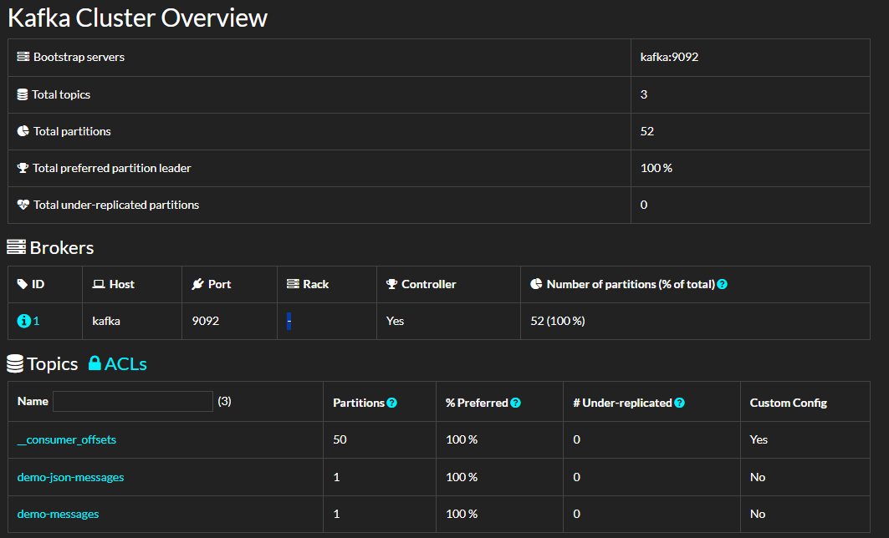
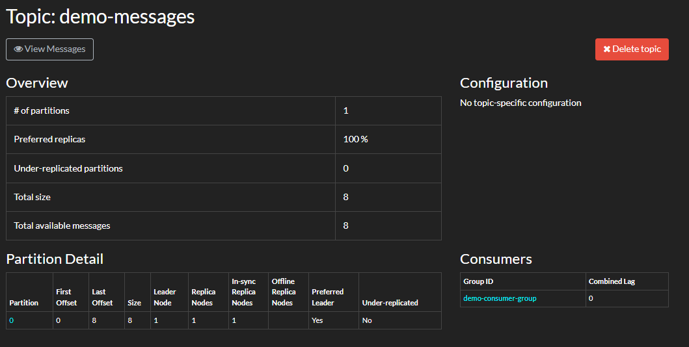
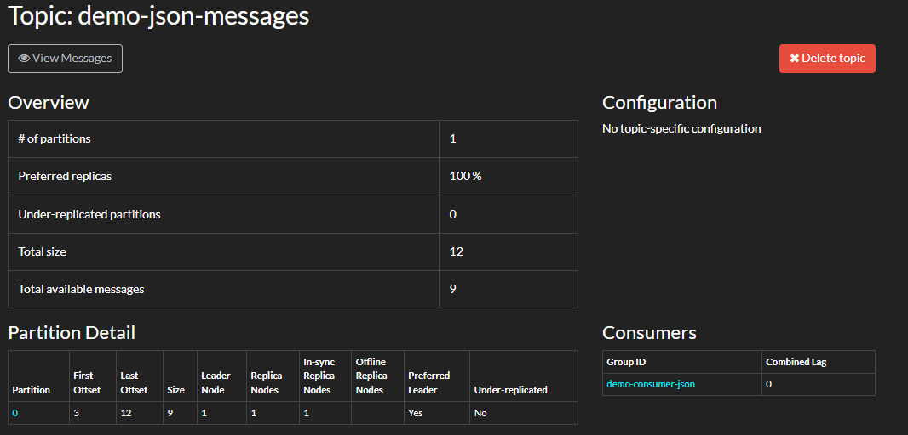
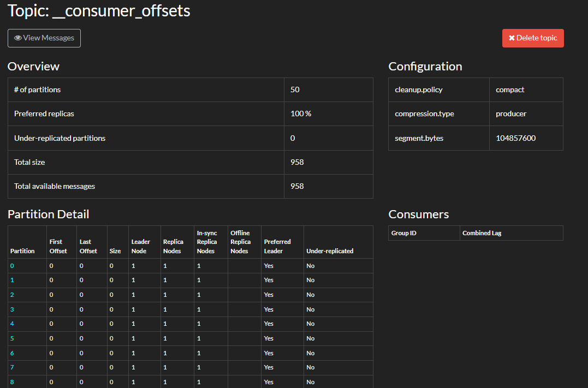

# Kafka Pub/Sub Basic System (Producer–Consumer)
#### By Oscar SCHWARTZ and Mathis LEITAO - ING4 DATA&IA Gr01

## Project Overview

This project demonstrates a **basic Publish/Subscribe messaging system** using **Apache Kafka**.  
It showcases how producers can publish messages to a Kafka topic and how consumers can subscribe to and process these messages asynchronously.

The project is implemented using:
- **Kafka** (Docker-based)
- **Python producers and consumers**
- **JSON message format**
- **Kafdrop** for monitoring and visualization

This project was developed as part of the **Big Data Frameworks** course to illustrate core messaging concepts in Big Data architectures.

---

## Why Kafka?

Apache Kafka is a distributed event streaming platform designed for:
- High-throughput data ingestion
- Decoupled producer/consumer architectures
- Real-time data pipelines
- Scalability and fault tolerance

Kafka is a core building block in modern Big Data ecosystems and is widely used for log ingestion, streaming analytics, microservices communication, and IoT pipelines.

---

## Technologies Used

- Apache Kafka (Docker)
- Docker Compose
- Python 3.12
- kafka-python library
- Kafdrop (Kafka Web UI)

---

## Project Architecture

Producer → Kafka Broker → Consumer  
                     ↘  
                      Kafdrop (Monitoring UI)

Kafka acts as a buffer and decoupling layer between producers and consumers.

---

## Prerequisites

- Docker Desktop
- Python 3.10+
- Git

---

## Setup Instructions

### 1. Clone the repository

```bash
git clone <your-repository-url>
cd kafka-pubsub-basic
```

## 2. Python environment setup (recommended)

To run the Kafka producer and consumer scripts, it is recommended to use a **Python virtual environment** to isolate dependencies.

### Create the virtual environment

From the root of the project:

```powershell
python -m venv .venv
```

### Activate the virtual environment (Windows)
```powershell
.\.venv\Scripts\activate
```

## Install dependencies
Upgrade pip and install the required packages:

```powershell
pip install --upgrade pip
pip install -r requirements.txt
```

## 3. Start Kafka and Kafdrop
Kafka and Kafdrop are started using Docker Compose.

### Start the services
```bash
docker compose up -d
```

Docker containers running:


Services exposed:

Kafka broker

Internal (Docker network): kafka:9092

Host access: localhost:29092

Kafdrop UI: http://localhost:19000

### Stop the services
```bash
docker compose down
```

## 4. Demo 1 — Basic Producer / Consumer (Text Messages)
This demo shows a simple text-based messaging flow using Kafka.

### Start the consumer

```powershell
cd src
python consumer.py
```


### Start the producer (in another terminal)
```powershell
cd src
python producer.py
```


Expected behavior:
The producer sends text messages to Kafka
The consumer receives and displays them
The topic appears in Kafdrop

## 5. Demo 2 — JSON-based Producer / Consumer

This demo demonstrates **structured event messaging** using JSON, which is a common best practice in real-world Kafka pipelines.  
Instead of sending plain text, the producer sends JSON objects (events), and the consumer deserializes them back into Python dictionaries.

### 5.1 JSON message format (example)

```json
{
  "event_id": "uuid",
  "type": "chat_message",
  "user": "Oscarico",
  "text": "Hello it's rainings cats and dogs today !",
  "index": 1,
  "timestamp": 1730000000
}
```

### 5.2 Run the JSON Consumer

Open a terminal, activate the virtual environment, then run the JSON consumer:

```powershell
cd src
python consumer_json.py
```
The consumer subscribes to the Kafka topic demo-json-messages and continuously listens for incoming JSON events.


This confirms that:
- the consumer is connected to Kafka
- JSON messages are correctly deserialized
- message keys and payloads are correctly processed

### 5.3 Run the JSON Producer

In a second terminal, activate the same virtual environment and run the producer:

```powershell
cd src
python producer_json.py
```
The producer sends multiple JSON-formatted events to Kafka.

results:


The consumer subscribes to the Kafka topic demo-json-messages and continuously listens for incoming JSON events.


Expected behavior:
- JSON messages are published to the topic
- the consumer receives and displays them in real time
- the topic demo-json-messages becomes visible in Kafdrop

### 5.4 Verification with Kafdrop

Open the Kafka monitoring interface:

```
http://localhost:19000
```

Kafdrop provides a web-based UI to inspect Kafka brokers, topics, partitions, and messages.

#### 5.4.1 Kafka Cluster Verification (Kafdrop)

To verify that the Kafka cluster is running correctly, Kafdrop was used as a web-based Kafka monitoring tool.

The following screenshot shows the global cluster overview, including:
- The active broker
- The number of topics
- Partition distribution
- Replication status


This screenshot shows the global Kafka cluster overview in Kafdrop, including the active broker, available topics, partition distribution, and replication status. It confirms that the Kafka infrastructure is running correctly.

#### 5.4.2 Text-Based Pub/Sub Example

A first Kafka topic (`demo-messages`) was created to demonstrate a basic Producer–Consumer pattern using plain text messages.

The following screenshot shows:
- The topic configuration
- Stored messages
- The consumer group reading from this topic
- No consumer lag (messages successfully consumed)


This topic (demo-messages) demonstrates a basic Producer–Consumer pattern using plain text messages. The consumer group successfully consumes all messages with no lag.

#### 5.4.3 JSON Pub/Sub Implementation

To improve the data structure and simulate a real-world use case, a second topic (`demo-json-messages`) was created using JSON-formatted messages.

This implementation uses:
- A JSON Producer sending structured messages
- A JSON Consumer deserializing and processing the messages
- Kafka consumer groups for offset management

The screenshot below confirms:
- Messages are correctly published
- Messages are consumed without lag
- The consumer group is active


This topic (demo-json-messages) shows the JSON-based implementation. Structured messages are published by the producer and consumed by the consumer group in real time.

#### 5.4.4 Kafka Internal Offset Management

Kafka internally manages consumer offsets using a dedicated topic called `__consumer_offsets`.

This topic is automatically created by Kafka and is used to:
- Track consumer group progress
- Enable fault tolerance
- Support message replay

The following screenshot shows the internal configuration of this topic, including compaction and partitioning.



Kafka internally manages consumer offsets using the __consumer_offsets topic. This screenshot highlights Kafka’s fault-tolerant offset tracking and compaction mechanism.

## 5.5 Summary

The JSON producer/consumer implementation demonstrates a realistic Kafka usage scenario.
It reflects how Kafka is commonly used in Big Data pipelines to transport structured events between distributed systems.

## 6 My Setup Notes

During the setup of this Kafka Pub/Sub project, I encountered several technical challenges that helped me better understand both Kafka and the surrounding ecosystem.

### 1. Kafka Python Client Compatibility Issue

While implementing the JSON Producer and Consumer in Python, I initially encountered the following error when running the scripts:
```
ModuleNotFoundError: No module named 'kafka.vendor.six.moves'
```
This issue occurred because the `kafka-python` library is not fully compatible with Python 3.12 in certain versions. The error was raised internally when Kafka attempted to import legacy dependencies.

**Resolution:**
- I isolated the issue by checking stack traces and testing imports in isolation.
- I resolved it by:
  - Creating a dedicated Python virtual environment
  - Installing a compatible version of `kafka-python`
  - Ensuring that VS Code was using the correct interpreter

This reinforced the importance of environment isolation when working with Big Data tooling and Python dependencies.

---

### 2. Docker Image Resolution Issues

While launching the Kafka stack with Docker Compose, I encountered errors such as:
```
failed to resolve reference "docker.io/bitnami/kafka"
```

This issue was caused by incorrect or unavailable image tags in the `docker-compose.yml` file.

**Resolution:**
- I verified image availability on Docker Hub
- Updated image references to valid and stable tags
- Re-ran the containers and verified successful startup using `docker ps`

This step highlighted the importance of understanding container image versions and registry resolution when deploying distributed systems.

---

### 3. Understanding Kafka Internal Topics

While using Kafdrop, I noticed the presence of the `__consumer_offsets` topic, which initially seemed unexpected.

After investigation, I learned that:
- Kafka internally uses this topic to track consumer group offsets
- The topic is compacted and fault-tolerant
- This mechanism ensures reliable message consumption and recovery

This helped me better understand Kafka’s internal architecture and how consumer state is managed in a distributed environment.

---

### Key Takeaways

Through these challenges, I gained hands-on experience with:
- Kafka Producer–Consumer patterns
- JSON message serialization
- Docker-based service orchestration
- Debugging distributed systems
- Kafka monitoring and internal mechanisms

Overall, troubleshooting these issues significantly improved my confidence in working with real-world Big Data pipelines.
